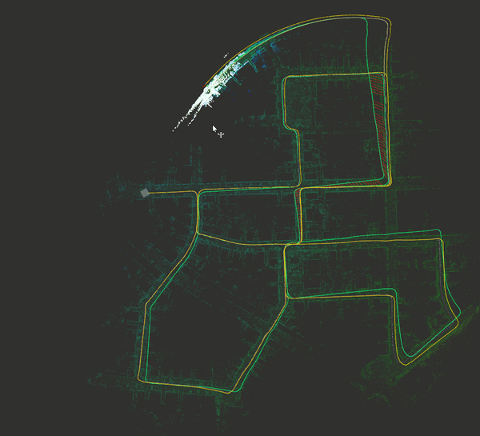
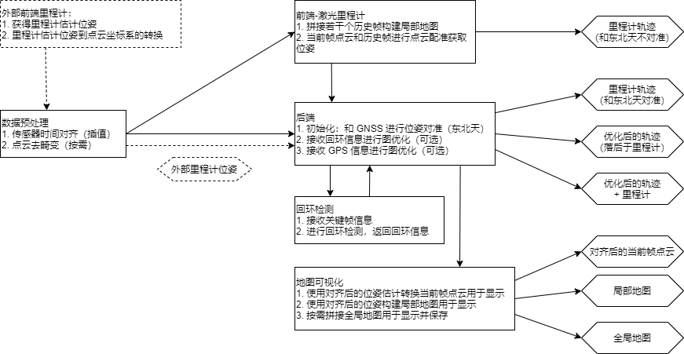

# Modular Mapping and Localization Framework

## 介绍

这个项目基本上是基于任乾大佬的建图定位框架框架进行修改，主要是为了对自动驾驶建图和定位过程中使用的各种算法进行实现和比较。仅为**个人学习使用**。关于原 Repo 参见： [localization_in_auto_driving](https://github.com/Little-Potato-1990/localization_in_auto_driving) ，也推荐大佬的 [从零开始做自动驾驶定位](https://zhuanlan.zhihu.com/c_1114864226103037952) 系列文章。

节点间整体的工作流程见（只包含建图部分）：

## 测试环境

- Ubuntu 18.04 (ROS Melodic) / 20.04 (ROS Noetic)
- PCL 1.8/1.10
- Eigen 3.3.5/3.3.7
- [Ceres](https://github.com/ceres-solver/ceres-solver/tree/276d24c73a8c80e77ce822ed4ab6e6286fd2870b)、[G2O](https://github.com/RainerKuemmerle/g2o/tree/f3b1cbb0048197d73cf363cb1c26897493e1aa2b)、[Geographiclib](https://github.com/geographiclib/geographiclib/tree/920702bc36ea13c384686556f25fb6369141a8e1)、[Sophus](https://github.com/strasdat/Sophus/tree/49a7e1286910019f74fb4f0bb3e213c909f8e1b7) 使用版本见 third_party_libs 中的 submodules

## 测试数据

- [x] KITTI with synced IMU (10 Hz)
- [ ] KITTI with raw IMU (100 Hz)
- [ ] KAIST

## 已测试模块

- 前端：
    - ICP, NDT 点云配准：[ICP, NDT 实现和性能对比](https://xiaotaoguo.com/p/pointcloud-registration/)
    - [A-LOAM](https://github.com/HKUST-Aerial-Robotics/A-LOAM)
    - [Lego-LOAM](https://github.com/RobustFieldAutonomyLab/LeGO-LOAM) （感谢 [@Mitchell-Lee-93](https://github.com/Mitchell-Lee-93) 对 lego-loam 在 KITTI 数据集上做的适配）
- 图优化后端：
    - G2O
    - Ceres
    - GTSam
- 回环检测：
    - 基于距离检测
    - 基于 Scan Context 检测：[基于 SC 和距离进行回环检测对比](https://xiaotaoguo.com/p/lidar_loop_closure/)

